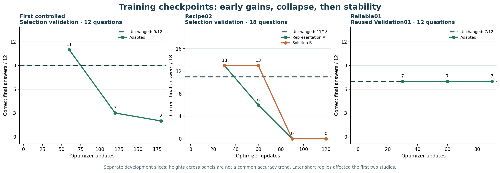
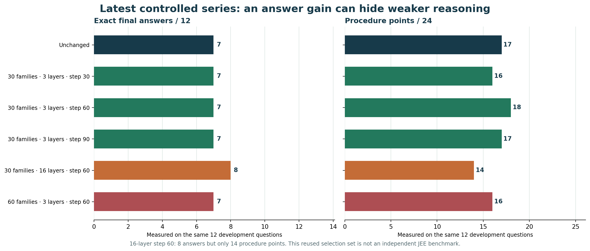

# Experimental JEE solver adapter history (MLX)

**Research archive; no checkpoint is selected as an improved JEE solver.** These are five small LoRA adapters trained on the pinned MLX 4-bit [Qwen3.5-9B base](https://huggingface.co/mlx-community/Qwen3.5-9B-4bit). The original upstream model is [Qwen/Qwen3.5-9B](https://huggingface.co/Qwen/Qwen3.5-9B). Weights for the unchanged base are not duplicated here. The vision encoder and base weights remained frozen during these experiments.

This repository exists to show the actual progression, including regressions. **Do not choose a checkpoint just because one metric looks better.** All five included adapters are experimental; our frozen selection rule promoted none from this latest series. They are MLX-VLM-specific adapters, not a standalone model and not standard PEFT adapters. The [browser preview](https://ompatnaik.com/JEE_9B_MODEL/) runs a separate unchanged 0.8B model on the visitor's device; the [matching Hugging Face archive](https://huggingface.co/OmTheLast/jee-solver-experimental-mlx-adapters) does not host an inference endpoint. See `load_mlx.py` for a command-line 9B loader and [EXPERIMENT_HISTORY.md](EXPERIMENT_HISTORY.md) for the preceding studies.

## Two interactive harnesses

| Harness | Runs which model, where? | What is recorded? |
|---|---|---|
| [Original local 9B lab](local_lab/README.md) | Pinned unchanged Qwen3.5-9B MLX or three experimental adapters; inference runs on a compatible Apple Silicon Mac | Streams output and saves attempts under local, Git-ignored `local_lab/runs/`. These attempts are not published. |
| [Transformers.js browser demo](web/README.md) | Separate unchanged Qwen3.5-0.8B ONNX; inference runs in a WebGPU browser | Shows working and narrow format/calculation checks in the page. It does not use the 9B LoRA weights or upload questions to this GitHub repository. |

The original lab is a format-checking exploratory interface, not yet a full calculator/verification harness. To run it from a clone, follow [its setup guide](local_lab/README.md). Its earlier development-workspace attempts remain in that private workspace; this repository offers the same local history feature for new attempts. The browser source and built GitHub Pages assets are both included.

## Progress graphs

[](charts/README.md)

[](charts/README.md)

The first graph keeps separate validation slices in separate panels. The second compares exact answers **and** procedure quality on the same latest 12-question development slice. Read the [chart notes and source data](charts/README.md) before interpreting the bars as progress.

For the main problems encountered while building and testing this system, read [Issues and lessons](ISSUES_AND_LESSONS.md). The longer [9B training retrospective](TRAINING_RETROSPECTIVE.md) explains why some adapters regressed, which explanations are measured versus hypothetical, and the safeguards being carried into the approximately 4B program.

## Current 4B-class model selection and export work

The next model is not being chosen by parameter label or one accuracy number. The [staged selection plan](research/MODEL_SELECTION_4B_PLAN.md) screens Qwen3.5-4B, Gemma3n E4B-it and LFM2.5-VL-3B, with narrowly chosen challengers, on reasoning, procedure, image fidelity, completion, memory, latency, licensing, trainability and a reproducible trained-weight browser path. Exact model revisions are recorded in the [candidate manifest](research/candidate-manifest-v1.json).

The [9B portability experiment](research/EXPORT09B01_STAGE_B_RESULT.md) successfully mapped an MLX adapter to PEFT and verified native text/image behavior. It then stopped honestly: current public Qwen3.5 tooling can run community ONNX builds but does not expose a reproducible exporter for our trained weights. No 9B browser model is claimed. The representation converter is retained in [`conversion_lab/`](conversion_lab/README.md).

The first browser product should use its solver model's integrated vision. A second small visual model remains a [three-condition hybrid ablation](research/VISION_FRONTEND_ABLATION.md), because OCR help must outweigh extra memory/latency and the risk of losing diagram relations.

The first unchanged-model screen and matched 24-question development pilot are now complete. [Qwen3.5-4B remains a conditional survivor](research/SMALL_MODEL_SELECTION_RESULT.md): it scored 13/24 against the unchanged 9B control's 15/24, but failed Chemistry Advanced and completion gates. LFM2.5-VL-3B and Qwen3-VL-4B-Thinking failed the six-item screen; Gemma3n E4B remains access-gated.

A follow-up [completion-control experiment](research/COMPLETION_CONTROL_RESULT.md) showed why the raw scores understate usable work. Another natural-language request for a short final failed. A forced answer serializer plus deterministic format normalization recovered supported answers without changing weights, producing provisional trigger-only effective scores of 15/24 for 4B and 19/24 for 9B. This is a harness gain on reused development data, not training or benchmark evidence. It motivates separate solve, verify and commit states before the next adapter run.

The 4B program is now explicitly [locked behind no-regression gates](research/TRAINING_SAFETY_GATES_V1.md). The unchanged base remains immutable; experimental adapters cannot replace it unless they preserve every canary, avoid cell/procedure/output regressions, improve on development under a frozen rule and then pass a fresh 120-family confirmation plus export parity. No 4B optimizer update has been authorized.

The first [solve→verify→commit diagnostic](research/VERIFICATION_DIAGNOSTICS_RESULT.md) found a useful boundary. Atomic one-claim calls produced 24/24 parseable, uncapped checks across unchanged 4B and 9B, but only 1/12 and 3/12 decisive chemistry facts were coordinator-correct on three deliberately difficult reused questions. Atomic checking is therefore a stopping/format primitive, not a correctness oracle. The [harness contract](research/HARNESS_STATE_MACHINE_V1.md) now keeps independent checks separate from the solver answer and routes unresolved science to abstention or trusted evidence.

The first [4B curriculum tranche](research/FIRST_4B_CURRICULUM_TRANCHE.md) is now prepared: 60 independent balanced families produce 180 linked atomic-check, method-plan and solve/commit views. Coordinator contract review and Qwen3.5-4B image/token/mask checks passed, with every view below 1,036 tokens. No 4B optimizer update has run; private questions and answers are excluded from this repository. Independent expert review and expansion toward 300 families remain before a training release.

## Development history

All rows below used the same **12-question Validation01 development slice** with the same inference settings: seed 0, temperature 0, 4,096 output-token cap and 240-second deadline. It was used to inspect and select checkpoints; repeated use makes it unsuitable as independent evidence of general JEE performance. Procedure points are coordinator ratings (valid=2, partial=1, invalid=0), not external expert certification. A cap is an output stopped by the 4,096-token budget. Scores are strict final answers.

| Condition | Training exposure | Strict answers | Procedure points | Token caps |
|---|---|---:|---:|---:|
| Unchanged base | — | 7/12 | 17/24 | 5 |
| reliable01-step030 | 30 families · 3 layers · step 30 | 7/12 | 16/24 | 4 |
| reliable01-step060 | 30 families · 3 layers · step 60 | 7/12 | 18/24 | 5 |
| reliable01-step090 | 30 families · 3 layers · step 90 | 7/12 | 17/24 | 5 |
| coverage16-step060 | 30 families · 16 layers · step 60 | 8/12 | 14/24 | 2 |
| data60-step060 | 60 families · 3 layers · step 60 | 7/12 | 16/24 | 5 |

Reliable01 trained on 30 reviewed question families over three complete passes with rank-4 LoRA on the final three language-model MLP layers. Step 60 gave slightly better procedure points than the base but tied it on answers and failed the predeclared 21/24 procedure threshold for an answer tie. Step 90 returned to the base procedure score. The coverage experiment kept the 30 families and adapted the final 16 language layers: it reached 8/12 answers and only two caps, but procedure quality fell to 14/24. The data experiment kept the narrow three-layer scope and expanded to 60 families: 7/12 answers, 16/24 procedure points and five caps. Both newer arms were stopped at their decision gates. None is a validated general JEE improvement.

Earlier pilot and learning probes led to this controlled series but used different data and/or evaluation conditions, so their scores are not pooled into the table. The first controlled run did select a step-60 adapter *within that run*, but its later 29-question evaluation tied the unchanged base; [the full timeline](EXPERIMENT_HISTORY.md) distinguishes that local selection from a promoted solver. No protected Eval01 or reserved 2026 question was used to promote the latest-series checkpoints. The 12-item development sample is too small to support a broad accuracy claim.

## Contents and provenance

- `adapters/*/adapter.safetensors`: the whitelisted trainable LoRA tensors only. No optimizer state, question images/text, answers, private review material or user interactions are included.
- `adapters/*/jee_adapter.json`: exact LoRA scope, rank and scale. This is a project-specific config, not a PEFT config.
- `release.json` and `SHA256SUMS`: pinned base revision and file hashes.
- `history.csv`: the table above in machine-readable form.
- `EXPERIMENT_HISTORY.md`: earlier experiment chronology and reasons we did not treat local selections as a finished solver.
- `TRAINING_RETROSPECTIVE.md`: measured causes, design mistakes and safeguards from the 9B program.
- `research/`: 4B-class model selection, no-regression gates, solve/verify/commit diagnostics, visual-frontend ablation and 9B portability result.
- `conversion_lab/`: MLX-LoRA-to-PEFT representation converter and scope notes.
- `local_lab/`: runnable local 9B streaming interface with private on-disk attempt history.
- `web/` and `docs/`: Transformers.js browser source and built GitHub Pages preview.
- `charts/`: source-labelled progress charts, data and rebuild script.
- `load_mlx.py`: a small local loader with tensor name/shape checks.

Pinned base: `mlx-community/Qwen3.5-9B-4bit` at revision `8b2b98c00a6b4d291155e4890773ca8f769aee53`. The upstream base and MLX quantization pages identify Apache-2.0 licensing. This package contains adapters and helper code only. Training used 30 or 60 source-reviewed JEE families across mathematics, physics and chemistry, balanced by Main/Advanced; subject-expert certification and broader generalization testing remain pending. Original exam questions and solutions are deliberately absent from this release.

## Load locally

Install compatible versions on Apple Silicon (the tested environment used MLX 0.32.2, MLX-VLM 0.7.1 and Hugging Face Hub). After downloading this repository, from its root run:

```sh
python load_mlx.py --adapter reliable01-step060 --question "A particle starts from rest and accelerates at 2 m/s^2 for 3 s. Find its displacement."
```

The helper downloads the pinned base from Hugging Face and loads the selected adapter. For ordinary use, start from the upstream unchanged base while the adapter recipe is still under investigation. The eventual student-facing solver will also require a tested harness for problem decomposition, calculation, verification, convention handling and stopping. A browser-local or phone-local deployment has not been demonstrated by these 9B MLX artifacts.

## Limitations

This is an experimental research record, not a reliable exam-answering product. Diagram reading, multi-step reasoning, answer commitment and token-budget management still fail on some questions. A parseable final answer can still be wrong. Do not use the scores as a public benchmark or as a claim that the adapted model beats the unchanged base. Reproduction requires the pinned base and a compatible MLX/MLX-VLM implementation; behavior may differ with other quantizations or prompt/harness settings.
