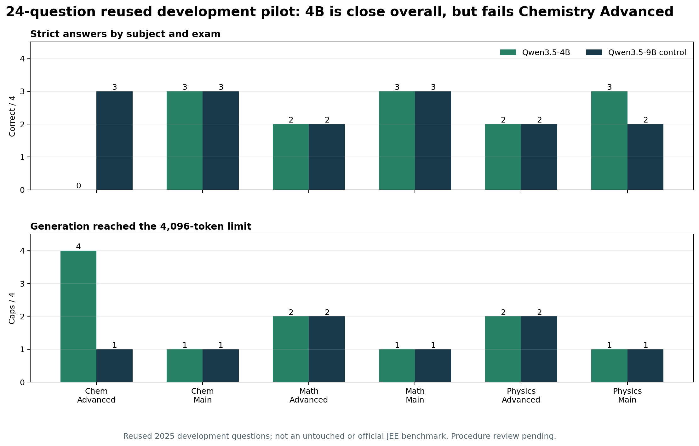
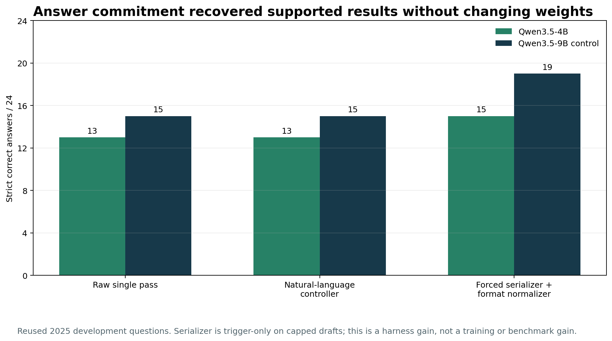

# What training changed, in charts

**Checkpoint trajectories.** Each panel uses a different development set; the dashed line is that study's unchanged 9B result. The first 30-family run gained on its 12-question validation at step 60 but dropped sharply later. Recipe02's two exercise mixtures reached 13/18 early, then developed short-output failures. Reliable01's lower-rate, uniform-target run remained stable but tied the base at 7/12. The first run's separate 29-question evaluation tied 22/29; Recipe02's separate 36-question comparison was base 19, A 19, B 20. The graph does **not** combine those evaluation sets into a single trend. Sources: [first controlled report](../EXPERIMENT_HISTORY.md), [Recipe02 report](https://github.com/OmTheLast/JEE_9B_MODEL/blob/main/EXPERIMENT_HISTORY.md) and the original local experiment records described there. Values are transcribed into [`training_trajectories.csv`](training_trajectories.csv).

**Latest controlled series.** Every row uses the same 12-question Validation01 development slice, so the two panels can be read together. The 16-layer arm gives one additional exact answer but substantially fewer procedure points. The 60-family arm ties the base on answers and has fewer procedure points. Procedure points are coordinator judgments: valid=2, partly valid=1, invalid=0; they are not independent expert certification. The set was reused for checkpoint decisions and cannot establish broad JEE accuracy. Data come from [`history.csv`](../history.csv) and the per-arm decisions in [EXPERIMENT_HISTORY.md](../EXPERIMENT_HISTORY.md).

**Small-model selection pilot.** Qwen3.5-4B scored13/24 versus15/24 for unchanged Qwen3.5-9B on the same24 reused2025 development questions. The cell view exposes the decisive problem hidden by the close overall score:4B was0/4 in Chemistry Advanced and capped on all four. Values are in [`model_selection_pilot24.csv`](model_selection_pilot24.csv). This set has been used for model selection and is not untouched evidence.

**Completion state.** A natural-language controller did not improve strict answers. Pre-filling the answer state and deterministically normalizing explicit option labels/numbers raised the trigger-only effective results to15/24 for4B and19/24 for9B. Coordinator review found the six recovered correct choices supported or partly supported by their preceding drafts. Wrong drafts still produced wrong choices. Values are in [`completion_control_pilot24.csv`](completion_control_pilot24.csv); the full limitations are in the [completion report](../research/COMPLETION_CONTROL_RESULT.md).

Rebuild the historical training charts with `python3 charts/make_charts.py` and the model-selection charts with `python3 charts/make_model_selection_charts.py` from the repository root after installing matplotlib. Both SVG and PNG files are generated. The charts contain no exam questions, model response text, private keys or user attempts. The protected 2026 final set was not used.
